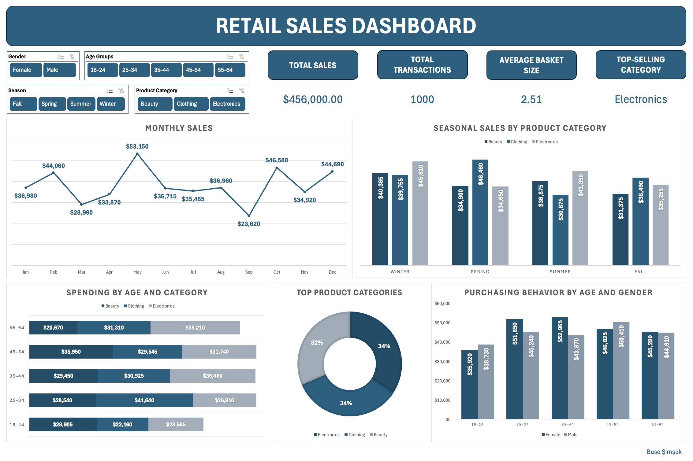

# 🛒 Retail Sales Dashboard

This project presents an interactive Excel dashboard built to visualize and analyze customer behavior and sales trends in a synthetic retail environment. The dashboard helps uncover key insights on how demographics, seasons, and product categories affect purchasing patterns.

## 🔗 Dataset Source

**Source:** [Kaggle - Retail Sales Dataset by Mohammad Talib](https://www.kaggle.com/datasets/mohammadtalib786/retail-sales-dataset)

This synthetic dataset mirrors a real-world retail setup, containing sales transactions and customer demographic data. It is ideal for hands-on practice in data exploration, dashboard design, and deriving insights for decision-making.

## 🗒️ Dataset Description

The dataset includes the following fields:

- **Transaction ID**
- **Date**
- **Customer ID**
- **Gender**
- **Age**
- **Product Category**
- **Quantity**
- **Price per Unit**
- **Total Amount**

I imported the raw `.csv` file into Excel and created three main worksheets in my workbook titled `Retail_Sales_Dashboard`:

## 📂 Project Structure

**1. Dataset Worksheet**  
- Checked for duplicates and validated data types  
- Converted currency formatting and dates  
- Added two new columns:  
  - `Age Groups` (18–24, 25–34, 35–44, 45–54, 55–64)  
  - `Season` (Winter, Spring, Summer, Fall)  
  → These were created to enhance pivot analysis.

**2. Pivot Table Worksheet**  
- Created pivot tables and pivot charts  
- Calculated key performance indicators (KPIs)

**3. Dashboard Worksheet**  
- Designed an interactive, user-friendly dashboard  
- Integrated slicers for dynamic filtering  
- Summarized insights visually

## 📈 Dashboard Highlights

### 🔍 Slicers:
- Gender
- Age Groups
- Season
- Product Category

### 🎯 KPIs:
- **Total Sales:** $456,000  
- **Total Transactions:** 1000  
- **Average Basket Size:** 2.51  
- **Top-Selling Category:** Electronics

### 📊 Charts & Visuals:
- **Monthly Sales Trend**
- **Seasonal Sales by Product Category**
- **Spending by Age and Product Category**
- **Top Product Categories**
- **Purchasing Behavior by Age and Gender**

> 📷 See screenshot above for full visual.

## ❓ Exploratory Questions Addressed

- How do age and gender influence spending habits?
- Which seasons and age groups drive the most sales?
- What product categories are most popular?
- How does basket size relate to transaction volume?
- Are there visible demographic or seasonal trends in shopping?

## 🛠 Tools Used

- Microsoft Excel (Pivot Tables, Pivot Charts, Slicers, KPI calculations)
- Basic data cleaning and transformation in Excel

## 💬 Final Notes

This dashboard showcases how Excel can be used to transform a raw dataset into an interactive, analytical tool. It combines both storytelling and functional design to deliver meaningful business insights.
